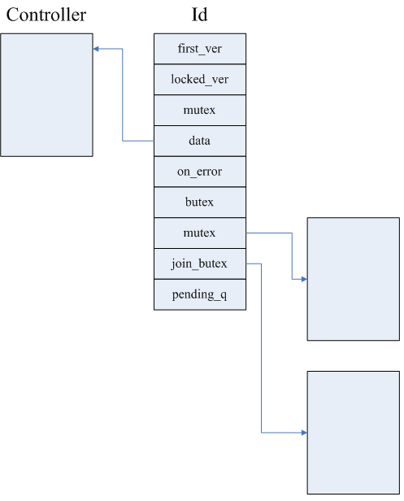

### 概述

在一次RPC过程中，由于设置超时定时器和开启Backup Request机制，不同的bthread可能会同时操作该次RPC独有的Controller结构，会存在下列几种竞态情况：
* 第一次Request发出后，在backup_request_ms内未收到响应，触发Backup Request定时器，定时任务执行的同时可能收到了第一次Request的Response，处理定时任务的bthread和处理Response的bthread需要做互斥
* 第一次Request和Backup Request可能同时收到Response，分别处理两个Response的bthread间需要做互斥

brpc中

### 内存布局

一次RPC过程中，Id、Controller、Butex的内存布局如下图所示：

主要字段说明：

主要代码在src/bthread/id.cpp中，解释下几个主要的函数的作用：

### 具体实例

