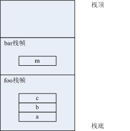

[线程执行协程与线程调用函数的不同](#线程执行协程与线程调用函数的不同)

[协程的原理与实现方式](#协程的原理与实现方式)

## 线程执行协程与线程调用函数的不同
一个pthread系统线程执行一个函数时，需要在pthread的线程栈上为函数创建栈帧，函数的形式参数和局部变量都分配在栈帧内。函数执行完毕后，按逆序销毁函数局部变量，再销毁栈帧。假设有一个线程A开始执行下面的foo函数：

```c++
void bar(int m) {
  // ...
}

int foo(int a, int b) {
  int c = a + b;
  bar(c);
  // 执行点1
  // ...
}
```

执行到foo函数中的执行点1时，线程A的栈帧如下图所示：




## 协程的原理与实现方式
协程有三个组成要素：一个可供执行的代码段（通常是一个函数），一个存储寄存器状态的结构，一个私有栈空间。

