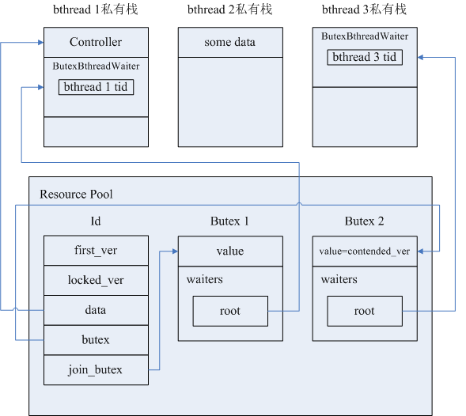

## 概述
在一次RPC过程中，由于设置超时定时器和开启Backup Request机制，不同的bthread可能会同时操作该次RPC独有的Controller结构，会存在下列几种竞态情况：
* 第一次Request发出后，在backup_request_ms内未收到响应，触发Backup Request定时器，定时任务执行的同时可能收到了第一次Request的Response，处理定时任务的bthread和处理Response的bthread需要做互斥
* 第一次Request和Backup Request可能同时收到Response，分别处理两个Response的bthread间需要做互斥

brpc中

## 内存布局
一次RPC过程中，Id、Controller、Butex的内存布局如下图所示：



Id结构主要字段：

first_ver：如果Butex结构的value值为first_ver，则表示当前没有bthread在访问Controller结构

locked_ver：如果Butex结构的value值被设为locked_ver，则表示当前已有一个bthread在操作Controller

mutex：类似futex的线程锁，由于试图操作同一Controller的若干bthread可能在不同的系统线程pthread上被执行，所以同时访问Controller时需要先做pthread间的互斥

data：指向Controller的指针

Butex结构中主要是存储了一个双向链表waiters，链表的每个元素ButexWaiter存储了挂起的bthread的一些信息


## 源码解释
主要代码在src/bthread/id.cpp中，解释下几个主要的函数的作用：

```c++
// bthread访问Controller对象前必须要执行bthread_id_lock，实际上是调用bthread_id_lock_and_reset_range_verbose
// 在这个函数中会bthread会根据Id的mutex指针指向的Butex结构中value的当前值，来判断下一步的动作：
// 1、如果value=first_ver，当前没有bthread在操作Controller，则把Butex的value置为locked_ver，
      告诉后来的bthread“我正在操作Controller，其他bthread先等待”，再去操作Controller；
// 2、
int bthread_id_lock_and_reset_range_verbose(
    bthread_id_t id, void **pdata, int range, const char *location) {
    bthread::Id* const meta = address_resource(bthread::get_slot(id));
    if (!meta) {
        return EINVAL;
    }
    // id_ver是call_id（一次RPC由于重试等因素可能产生多次call，每个call有其唯一id）
    const uint32_t id_ver = bthread::get_version(id);
    // butex指针指向的是Butex结构的第一个元素：整型变量value
    uint32_t* butex = meta->butex;
    bool ever_contended = false;
    // 这段代码可以被位于不同pthread上的多个bthread同时执行，所以需要先加线程锁
    meta->mutex.lock();
    while (meta->has_version(id_ver)) {
        if (*butex == meta->first_ver) {
            // 执行到这里，表示当前没有其他bthread在访问Controller
            // contended locker always wakes up the butex at unlock.
            meta->lock_location = location;
            if (range == 0) {
                // fast path
            } else if (range < 0 ||
                       range > bthread::ID_MAX_RANGE ||
                       range + meta->first_ver <= meta->locked_ver) {
                LOG_IF(FATAL, range < 0) << "range must be positive, actually "
                                         << range;
                LOG_IF(FATAL, range > bthread::ID_MAX_RANGE)
                    << "max range is " << bthread::ID_MAX_RANGE
                    << ", actually " << range;
            } else {
                // range是一次RPC的重试次数，如果first_ver=1，一次RPC在超时时间内允许重试3次，则locked_ver=4
                meta->locked_ver = meta->first_ver + range;
            }
            // 1、如果是第一个访问Controller的bthread，则把butex指向的Butex结构的value的值置为locked_ver
            // 2、如果是曾经被挂起的bthread，则把value的值置为contended_ver
            *butex = (ever_contended ? meta->contended_ver() : meta->locked_ver);
            // Butex的value已经被重置，后来的bthread看到value后就会得知已经有一个bthread在访问Controller，可以释放线程锁了
            meta->mutex.unlock();
            if (pdata) {
                // 找到Controller的指针并返回
                *pdata = meta->data;
            }
            return 0;
        } else if (*butex != meta->unlockable_ver()) {
            // 执行到这里，表示之前已经有bthread正在访问Controller且还没有访问完成，执行这段代码的bthread必须要挂起
            // 挂起是指：bthread将当前各寄存器的值存入context结构，让出cpu，执行这个bthread的pthread从TaskGroup的任务队列中取出下一个bthread去执行
            *butex = meta->contended_ver();
            // 挂起的bthread必须由之前将Butex的value设为expected_ver的bthread唤醒，expected_ver的作用就是防止ABA问题
            uint32_t expected_ver = *butex;
            // 关键字段的重置已完成，可以释放线程锁了
            meta->mutex.unlock();
            // 已经出现了bthread间的竞态
            ever_contended = true;
            // 
            if (bthread::butex_wait(butex, expected_ver, NULL) < 0 &&
                errno != EWOULDBLOCK && errno != EINTR) {
                return errno;
            }
            // 重新去竞争线程锁，也不一定能竞争成功，所以上层要有一个while循环不断的去判断被唤醒的bthread抢到线程锁后可能检测到的value的各种不同值
            meta->mutex.lock();
        } else { // bthread_id_about_to_destroy was called.
            meta->mutex.unlock();
            return EPERM;
        }
    }
    meta->mutex.unlock();
    return EINVAL;
}
```

```c++
int bthread_id_unlock(bthread_id_t id) {
    bthread::Id* const meta = address_resource(bthread::get_slot(id));
    if (!meta) {
        return EINVAL;
    }
    uint32_t* butex = meta->butex;
    // Release fence makes sure all changes made before signal visible to
    // woken-up waiters.
    const uint32_t id_ver = bthread::get_version(id);
    meta->mutex.lock();
    if (!meta->has_version(id_ver)) {
        meta->mutex.unlock();
        LOG(FATAL) << "Invalid bthread_id=" << id.value;
        return EINVAL;
    }
    if (*butex == meta->first_ver) {
        meta->mutex.unlock();
        LOG(FATAL) << "bthread_id=" << id.value << " is not locked!";
        return EPERM;
    }
    bthread::PendingError front;
    if (meta->pending_q.pop(&front)) {
        meta->lock_location = front.location;
        meta->mutex.unlock();
        if (meta->on_error) {
            return meta->on_error(front.id, meta->data, front.error_code);
        } else {
            return meta->on_error2(front.id, meta->data, front.error_code,
                                   front.error_text);
        }
    } else {
        const bool contended = (*butex == meta->contended_ver());
        *butex = meta->first_ver;
        meta->mutex.unlock();
        if (contended) {
            // We may wake up already-reused id, but that's OK.
            bthread::butex_wake(butex);
        }
        return 0; 
    }
}
```

```c++
int bthread_id_join(bthread_id_t id) {
    const bthread::IdResourceId slot = bthread::get_slot(id);
    bthread::Id* const meta = address_resource(slot);
    if (!meta) {
        // The id is not created yet, this join is definitely wrong.
        return EINVAL;
    }
    const uint32_t id_ver = bthread::get_version(id);
    uint32_t* join_butex = meta->join_butex;
    while (1) {
        meta->mutex.lock();
        const bool has_ver = meta->has_version(id_ver);
        const uint32_t expected_ver = *join_butex;
        meta->mutex.unlock();
        if (!has_ver) {
            break;
        }
        if (bthread::butex_wait(join_butex, expected_ver, NULL) < 0 &&
            errno != EWOULDBLOCK && errno != EINTR) {
            return errno;
        }
    }
    return 0;
}
```

```c++
int bthread_id_unlock_and_destroy(bthread_id_t id) {
    bthread::Id* const meta = address_resource(bthread::get_slot(id));
    if (!meta) {
        return EINVAL;
    }
    uint32_t* butex = meta->butex;
    uint32_t* join_butex = meta->join_butex;
    const uint32_t id_ver = bthread::get_version(id);
    meta->mutex.lock();
    if (!meta->has_version(id_ver)) {
        meta->mutex.unlock();
        LOG(FATAL) << "Invalid bthread_id=" << id.value;
        return EINVAL;
    }
    if (*butex == meta->first_ver) {
        meta->mutex.unlock();
        LOG(FATAL) << "bthread_id=" << id.value << " is not locked!";
        return EPERM;
    }
    const uint32_t next_ver = meta->end_ver();
    *butex = next_ver;
    *join_butex = next_ver;
    meta->first_ver = next_ver;
    meta->locked_ver = next_ver;
    meta->pending_q.clear();
    meta->mutex.unlock();
    // Notice that butex_wake* returns # of woken-up, not successful or not.
    bthread::butex_wake_except(butex, 0);
    bthread::butex_wake_all(join_butex);
    return_resource(bthread::get_slot(id));
    return 0;
}
```

## 执行时序示例
假设有三个bthread A、B、C（位于三个不同TaskGroup的可执行任务队列中，三个TaskGroup分别是三个pthread的线程私有对象）同时访问Controller，一个可能的执行时序如下：

T1时刻：A、B、C三个bthread同时执行到

T2时刻：

## 具体实例

