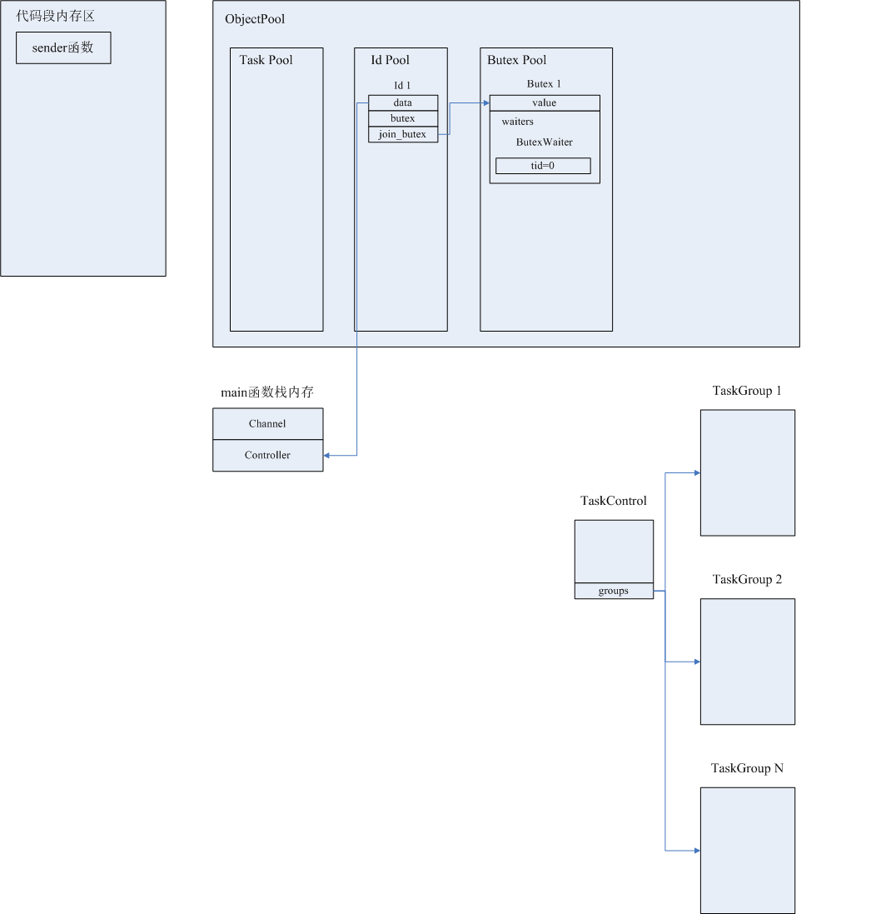

[一次RPC过程中需要bthread互斥的场景](#一次RPC过程中需要bthread互斥的场景)

[bthread互斥过程涉及到的数据结构](#bthread互斥过程涉及到的数据结构)

[brpc实现bthread互斥的源码解释](#brpc实现bthread互斥的源码解释)

[bthread互斥执行时序示例](#bthread互斥执行时序示例)

[一次RPC过程中发生bthread竞争时内存布局的变化过程](#一次RPC过程中发生bthread竞争时内存布局的变化过程)

## 一次RPC过程中需要bthread互斥的场景
在一次RPC过程中，由于设置RPC超时定时器和开启Backup Request机制，不同的bthread可能会同时操作本次RPC独有的Controller结构，会存在下列几种竞态情况：

1. 第一次Request发出后，在backup_request_ms内未收到响应，触发Backup Request定时器，试图发送Backup Request的同时可能收到了第一次Request的Response，发送Backup Request的bthread和处理Response的bthread需要做互斥；

2. 假设没有开启Backup Request机制，处理Response（可能是第一次Request的Response，也可能是某一次重试的Response）时刚好到了RPC超时时间，处理Response的bthread和处理RPC超时定时任务的bthread需要做互斥；

3. 第一次Request或者任何一次重试Request，与Backup Request可能同时刻收到Response，分别处理两个Response的bthread间需要做互斥；

4. 第一次Request或者任何一次重试Request，与Backup Request可能同时刻收到Response，此时也可能到了RPC超时时间，分别处理两个Response的bthread和处理RPC超时定时任务的bthread，三者之间需要做互斥。

## bthread互斥过程涉及到的数据结构
一次RPC过程中，会有一个Controller对象贯穿本次RPC的始终，Controller对象内存储本次RPC的各类数据和各种状态，bthread间的互斥就是指同一时刻只能有一个bthread在访问Controller对象。互斥主要是通过Id对象和Butex对象实现的。

1. Id对象

   brpc会在每一次RPC过程开始阶段创建本次RPC唯一的一个Id对象，用来保护Controller对象，互斥试图同时访问Controller对象的多个bthread。Id对象主要成员有：

   - first_ver & locked_ver
   
     如果Id对象的butex指针指向的Butex对象的value值为first_ver，表示Controller对象此时没有bthread在访问。此时如果有一个bthread试图访问Controller对象，则它可以取得访问权，先将butex指针指向的Butex对象的value值置为locked_ver后，再去访问Controller对象。
     
     在locked_ver的基础上又有contended_ver、unlockable_ver、end_ver，contended_ver = locked_ver + 1，unlockable_ver = locked_ver + 2，end_ver = locked_ver + 3。
     
     contended_ver表示同时访问Controller对象的多个bthread产生了竞态。如果有一个bthread（bthread 1）在访问Controller对象结束后，观察到butex指针指向的Butex对象的value值仍为locked_ver，表示没有其他的bthread在等待访问Controller对象，bthread 1在将Butex对象的value值改为first_ver后不会再有其他动作。如果在bthread 1访问Controller对象期间又有bthread 2试图访问Controller对象，bthread 2会观察到Butex对象的value值为locked_ver，bthread 2首先将Butex对象的value值改为contended_ver，意图就是告诉bthread 1产生了竞态。接着bthread 2需要将自身的bthread id等信息存储在Butex对象的waiters等待队列中，yield让出cpu，让bthread 2所在的pthread去执行TaskGroup任务队列中的下一个bthread任务。当bthread 1完成对Controller对象的访问时，会观察到Butex对象的value值已被改为contended_ver，bthread 1会到waiters队列中找到被挂起的bthread 2的id，通知TaskControl将bthread 2的id压入某一个TaskGroup的任务队列，这就是唤醒了bthread 2。bthread 1唤醒bthread 2后会将Butex对象的value值再次改回first_ver。bthread 2重新被某一个pthread调度执行时，如果这期间没有其他bthread在访问Controller对象，bthread 2会观察到Butex对象的value值为first_ver，这时bthread 2获得了Controller对象的访问权。
     
     

   - mutex
   
     类似futex的线程锁，由于试图同时访问同一Controller对象的若干bthread可能在不同的系统线程pthread上被执行，所以bthread在修改Id对象中的字段前需要先做pthread间的互斥

   - data
   
     指向本次RPC唯一的一个Controller对象的指针

   - butex
   
     指向一个Butex对象头节点的指针，
     
   - join_butex
   
     
Butex结构中主要是存储了一个双向链表waiters，链表的每个元素ButexWaiter存储了挂起的bthread的一些信息


## brpc实现bthread互斥的源码解释
主要代码在src/bthread/id.cpp中，解释下几个主要的函数的作用：


bthread_id_lock_and_reset_range_verbose：竞争butex锁、等待butex锁

```c++
// bthread访问Controller对象前必须要执行bthread_id_lock，实际上是调用bthread_id_lock_and_reset_range_verbose。
// 在这个函数中会bthread会根据Id的mutex指针指向的Butex结构中value的当前值，来判断下一步的动作：
// 1、如果value=first_ver，当前没有bthread在操作Controller，则把Butex的value置为locked_ver，
      告诉后来的bthread“我正在操作Controller，其他bthread先等待”，再去操作Controller；
// 2、
int bthread_id_lock_and_reset_range_verbose(
    bthread_id_t id, void **pdata, int range, const char *location) {
    bthread::Id* const meta = address_resource(bthread::get_slot(id));
    if (!meta) {
        return EINVAL;
    }
    // id_ver是call_id（一次RPC由于重试等因素可能产生多次call，每个call有其唯一id）。
    const uint32_t id_ver = bthread::get_version(id);
    // butex指针指向的是Butex结构的第一个元素：整型变量value。
    uint32_t* butex = meta->butex;
    bool ever_contended = false;
    // 这段代码可以被位于不同pthread上的多个bthread同时执行，所以需要先加线程锁。
    meta->mutex.lock();
    while (meta->has_version(id_ver)) {
        if (*butex == meta->first_ver) {
            // 执行到这里，表示当前没有其他bthread在访问Controller。
            // contended locker always wakes up the butex at unlock.
            meta->lock_location = location;
            if (range == 0) {
                // fast path
            } else if (range < 0 ||
                       range > bthread::ID_MAX_RANGE ||
                       range + meta->first_ver <= meta->locked_ver) {
                LOG_IF(FATAL, range < 0) << "range must be positive, actually "
                                         << range;
                LOG_IF(FATAL, range > bthread::ID_MAX_RANGE)
                    << "max range is " << bthread::ID_MAX_RANGE
                    << ", actually " << range;
            } else {
                // range是一次RPC的重试次数，如果first_ver=1，一次RPC在超时时间内允许重试3次，则locked_ver=4。
                meta->locked_ver = meta->first_ver + range;
            }
            // 1、如果是第一个访问Controller的bthread，则把butex指向的Butex结构的value的值置为locked_ver；
            // 2、如果是曾经被挂起的bthread，则把value的值置为contended_ver。
            *butex = (ever_contended ? meta->contended_ver() : meta->locked_ver);
            // Butex的value已经被重置，后来的bthread看到value后就会得知已经有一个bthread在访问Controller，可以释放线程锁了。
            meta->mutex.unlock();
            if (pdata) {
                // 找到Controller的指针并返回
                *pdata = meta->data;
            }
            return 0;
        } else if (*butex != meta->unlockable_ver()) {
            // 1、一个bthread（假设bthread id为C）执行到这里，Butex的value值要么是locked_ver，要么是contented_ver：
            //    a、如果value=locked_ver，表示当前有一个bthread A正在访问Controller且还没有访问完成，没有其他bthread被挂起；
            //    b、如果value=contented_ver，表示当前不仅有一个bthread A正在访问Controller且还没有访问完成，而且还有一个或多个
                     bthread（B、D、E...）被挂起，等待A唤醒。
            // 2、执行到这段代码的bthread必须要挂起，挂起前先将Butex的value置为contended_ver，告诉正在访问Controller的bthread，
                  访问完Controller后，要负责唤起挂起的bthread；
            // 3、挂起是指：bthread将当前各寄存器的值存入context结构，让出cpu，执行这个bthread的pthread从TaskGroup的任务队列中
                  取出下一个bthread去执行。
            *butex = meta->contended_ver();
            // 挂起的bthread必须由之前将Butex的value设为expected_ver的bthread唤醒，expected_ver的作用就是防止ABA问题。
            uint32_t expected_ver = *butex;
            // 关键字段的重置已完成，可以释放线程锁了。
            meta->mutex.unlock();
            // 已经出现了bthread间的竞态。
            ever_contended = true;
            // 新建ButexWaiter结构保存该bthread的主要信息并将ButexWaiter加入waiters链表，然后yield让出cpu，
            // bthread被重新执行后，从butex_wait函数返回处开始执行。
            if (bthread::butex_wait(butex, expected_ver, NULL) < 0 &&
                errno != EWOULDBLOCK && errno != EINTR) {
                return errno;
            }
            // 之前挂起的bthread被重新执行，重新去竞争线程锁，
            // 不一定能竞争成功，所以上层要有一个while循环不断的去判断被唤醒的bthread抢到线程锁后可能检测到的value的各种不同值。
            meta->mutex.lock();
        } else { // bthread_id_about_to_destroy was called.
            // Butex的value被其他bthread置为unlockable_ver，Id结构将被释放回资源池，Controller结构将被析构，即一次RPC已经完成，
            // 因此执行到这里的bthread直接返回，不会再有后续的动作
            meta->mutex.unlock();
            return EPERM;
        }
    }
    meta->mutex.unlock();
    return EINVAL;
}
```


bthread_id_unlock：释放butex锁，唤醒一个等待锁的bthread

```c++
int bthread_id_unlock(bthread_id_t id) {
    bthread::Id* const meta = address_resource(bthread::get_slot(id));
    if (!meta) {
        return EINVAL;
    }
    uint32_t* butex = meta->butex;
    // Release fence makes sure all changes made before signal visible to
    // woken-up waiters.
    const uint32_t id_ver = bthread::get_version(id);
    // 竞争线程锁
    meta->mutex.lock();
    if (!meta->has_version(id_ver)) {
        // call_id非法，严重错误
        meta->mutex.unlock();
        LOG(FATAL) << "Invalid bthread_id=" << id.value;
        return EINVAL;
    }
    if (*butex == meta->first_ver) {
        // 一个bthread执行到这里，观察到的Butex的value的值要么是locked_ver，要么是contented_ver，
        // 不可能是first_ver，否则严重错误
        meta->mutex.unlock();
        LOG(FATAL) << "bthread_id=" << id.value << " is not locked!";
        return EPERM;
    }
    bthread::PendingError front;
    if (meta->pending_q.pop(&front)) {
        meta->lock_location = front.location;
        meta->mutex.unlock();
        // 
        if (meta->on_error) {
            return meta->on_error(front.id, meta->data, front.error_code);
        } else {
            return meta->on_error2(front.id, meta->data, front.error_code,
                                   front.error_text);
        }
    } else {
        // 如果contended为true，则有N（N>=1）个bthread挂在Butex的waiters队列中，等待唤醒
        const bool contended = (*butex == meta->contended_ver());
        // Butex的value恢复到first_ver，表示当前的bthread对Controller的独占性访问已完成，后续被唤醒的bthread可以去独占性的访问Controller了
        *butex = meta->first_ver;
        // 关键字段已完成更新，释放线程锁
        meta->mutex.unlock();
        if (contended) {
            // We may wake up already-reused id, but that's OK.
            // 如果有bthread挂在waiters队列中，唤醒其中之一
            bthread::butex_wake(butex);
        }
        return 0; 
    }
}
```


bthread_id_join：
```c++
int bthread_id_join(bthread_id_t id) {
    const bthread::IdResourceId slot = bthread::get_slot(id);
    bthread::Id* const meta = address_resource(slot);
    if (!meta) {
        // The id is not created yet, this join is definitely wrong.
        return EINVAL;
    }
    const uint32_t id_ver = bthread::get_version(id);
    uint32_t* join_butex = meta->join_butex;
    while (1) {
        meta->mutex.lock();
        const bool has_ver = meta->has_version(id_ver);
        const uint32_t expected_ver = *join_butex;
        meta->mutex.unlock();
        if (!has_ver) {
            break;
        }
        // 挂在join_butex指向的Butex结构的waiter队列中，并yield让出cpu；
        // 恢复执行的时候，RPC过程已经完成，
        if (bthread::butex_wait(join_butex, expected_ver, NULL) < 0 &&
            errno != EWOULDBLOCK && errno != EINTR) {
            return errno;
        }
    }
    return 0;
}
```


bthread_id_about_to_destroy：
```c++
int bthread_id_about_to_destroy(bthread_id_t id) {
    bthread::Id* const meta = address_resource(bthread::get_slot(id));
    if (!meta) {
        return EINVAL;
    }
    const uint32_t id_ver = bthread::get_version(id);
    uint32_t* butex = meta->butex;
    meta->mutex.lock();
    if (!meta->has_version(id_ver)) {
        meta->mutex.unlock();
        return EINVAL;
    }
    if (*butex == meta->first_ver) {
        meta->mutex.unlock();
        LOG(FATAL) << "bthread_id=" << id.value << " is not locked!";
        return EPERM;
    }
    const bool contended = (*butex == meta->contended_ver());
    *butex = meta->unlockable_ver();
    meta->mutex.unlock();
    if (contended) {
        // wake up all waiting lockers.
        bthread::butex_wake_except(butex, 0);
    }
    return 0;
}
```


```c++
int bthread_id_unlock_and_destroy(bthread_id_t id) {
    bthread::Id* const meta = address_resource(bthread::get_slot(id));
    if (!meta) {
        return EINVAL;
    }
    uint32_t* butex = meta->butex;
    uint32_t* join_butex = meta->join_butex;
    const uint32_t id_ver = bthread::get_version(id);
    meta->mutex.lock();
    if (!meta->has_version(id_ver)) {
        meta->mutex.unlock();
        LOG(FATAL) << "Invalid bthread_id=" << id.value;
        return EINVAL;
    }
    if (*butex == meta->first_ver) {
        meta->mutex.unlock();
        LOG(FATAL) << "bthread_id=" << id.value << " is not locked!";
        return EPERM;
    }
    const uint32_t next_ver = meta->end_ver();
    *butex = next_ver;
    *join_butex = next_ver;
    meta->first_ver = next_ver;
    meta->locked_ver = next_ver;
    meta->pending_q.clear();
    meta->mutex.unlock();
    // Notice that butex_wake* returns # of woken-up, not successful or not.
    bthread::butex_wake_except(butex, 0);
    bthread::butex_wake_all(join_butex);
    return_resource(bthread::get_slot(id));
    return 0;
}
```

## bthread互斥执行时序示例
假设有三个bthread A、B、C（位于三个不同TaskGroup的可执行任务队列中，三个TaskGroup分别是三个pthread的线程私有对象）同时访问Controller，一个可能的执行时序如下：

T1时刻：A、B、C三个bthread同时执行到

T2时刻：

## 一次RPC过程中发生bthread竞争时内存布局的变化过程
以brpc自带的实例程序example/backup_request_c++/client.cpp为例，通过计算机中内存布局的变化，来讲述竞态发生时，程序的执行过程。

* 第一次请求发出后，还没到backup request timeout超时时间的时候，内存布局如下：



