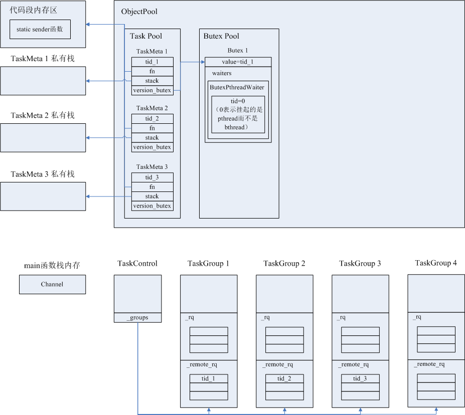

[数据发送过程涉及到的主要数据结构](#数据发送过程涉及到的主要数据结构) 

[数据发送过程中的系统内存布局与多线程执行状态](#数据发送过程中的系统内存布局与多线程执行状态) 

# 数据发送过程涉及到的主要数据结构
Channel

Controller

# 数据发送过程中的系统内存布局与多线程执行状态
以brpc自带的实例程序example/multi_threaded_echo_c++/client.cpp为例，结合Client端内存布局的变化过程，讲述无异常状态下的Client发送请求直到处理响应的过程。

该程序运行后，与单台服务器建立一条TCP长连接，创建N个bthread在此TCP连接上发送、接收数据，不涉及连接池、负载均衡。

这个程序的具体运行过程为：
1. 在main函数的栈上创建Channel；
2. 在heap内存上惰性初始化下列全局对象：

   a. 一个TaskControl单例对象；
   
   b. N个TaskGroup对象，每个TaskGroup对应一个系统线程pthread，是pthread的线程私有对象，每个pthread启动后执行TaskGroup的run_main_task函数，该函数是个无限循环，不停地获取bthread、执行bthread任务；
   
   c. 一个定时器对象。
   
3. 在TaskMeta对象池中创建N个TaskMeta对象（每个TaskMeta相当于一个bthread）（后续设N=3），每个TaskMeta的fn函数指针指向static类型函数sender，sender就是bthread的任务处理函数。每个TaskMeta创建完后，按照散列规则将其唯一标识tid压入一个TaskGroup对象的_remote_rq队列中。（TaskGroup所属的pthread线程称为worker线程，worker线程自己产生的bthread的tid会被压入_rq队列，这个实例中的main函数所在线程不属于worker线程，所以main函数的线程生成的bthread的tid会被压入TaskGroup的_rq队列）；

4. main函数执行到这里，不能直接结束，需要等待N个bthread任务全部执行完成后，才能结束。等待的实现机制是将main函数所在线程的信息存储在ButexPthreadWaiter中，并加入到bthread对应的TaskMeta的Butex的waiters队列中，等到TaskMeta的任务函数fn执行结束后，从waiters中找到等待中的pthread线程，将其唤醒。main函数所在的系统线程在join第一个bthread 1的时候就被挂起，等待在wait_pthread函数处。bthread 1执行结束后，main函数的线程才会被唤醒，继续向下执行，去join 下一个bthread。此时bthread 2可能是已经结束的状态，代码中也有相应的处理，判断出bthread 2工作结束，main的线程不会被挂起。

程序运行到此的状态是，三个bthread A、B、C已经创建完毕，bthread id已经被压入TaskGroup对象的任务队列_remote_rq，TaskGroup所属的pthread线程即将拿到bthread id，main函数所在线程被挂起，等待bthread A的结束。此时系统中存在5个线程：4个线程在各自的TaskGroup私有对象上不停地等待任务、处理任务，和main函数所在线程。此时刻的系统中的内存布局如下：

5. 各个TaskGroup所在的pthread从_remote_rq中拿到bthread id，进而从对象池中找到TaskMeta，开始执行TaskMeta的任务函数，即client.cpp中的static类型的sender函数。由于各个bthread有各自的私有栈空间，所以sender中的局部变量request、response、Controller对象均被分配在bthread的私有栈内存上。

6. 根据protobuf的标准编程模式，3个执行sender函数的pthread都会执行Channel的CallMethod函数，CallMethod函数的入参为各个TaskMeta任务私有的request、response、RpcController，内部执行过程是根据一些参数来填充RpcController实例的各个成员变量，没有pthread间的竞态，因此CallMethod本身是线程安全的。而Channel对象是main函数的栈上对象，main函数所在线程已被挂起，直到3个bthread全部执行完成后才会结束，所以Channel对象生命期是安全的。

7. 在CallMethod函数执行过程中，主要工作是完成对Controller对象成员变量的赋值，包括RPC起始时间戳、重试次数、RPC超时时间、Backup Request超时时间、标识一次RPC过程的唯一id correlation_id等等。Controller对象可以认为是存储了一次RPC过程的参数和状态。同时会构造Controller对象相关联的Id结构，该结构的作用是同步一次RPC过程中各个bthread，因为一次RPC过程，发送请求、接收请求、超时处理均是由不同的bthread负责，各个bthread可能运行在不同的pthread上，因此Controller对象可能被不同的pthread并发访问，Id结构的作用就是保护Controller对象同一时刻只能由一个bthread访问，如果运行在其他pthread上的bthread试图同时访问就会造成竞态，则后来的bthread只能挂起在Id的mutex队列中并yield让出cpu，等待当前访问Controller的bthread唤醒。具体运行过程参考[同一RPC过程中各个bthread间的同步](client_bthread_sync.md)这一节

8. 在CallMethod中设置Controller对象主要成员变量、构造了Id结构之后，线程执行流程转入Controller的IssueRPC函数，在该函数中按照指定协议格式将第一次请求的call_id、RPC方法名、实际待发送数据打包成报文，调用Socket的Write方法将报文通过TCP长连接发给服务器。Socket的Write函数具体运作过程参考[多线程向同一TCP连接写数据](io_write.md)。调用Write函数后，负责数据发送的bthread就完成了发送工作，需要调用bthread_id_unlock释放对Controller对象的独占访问。如果是bthread间synchronous方式，则负责数据发送的bthread调用bthread_id_join挂起，让出cpu，等待负责处理response的bthread来唤醒。

程序运行到此的状态是，

